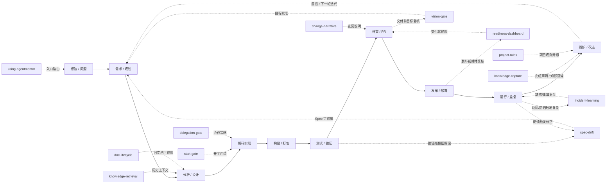
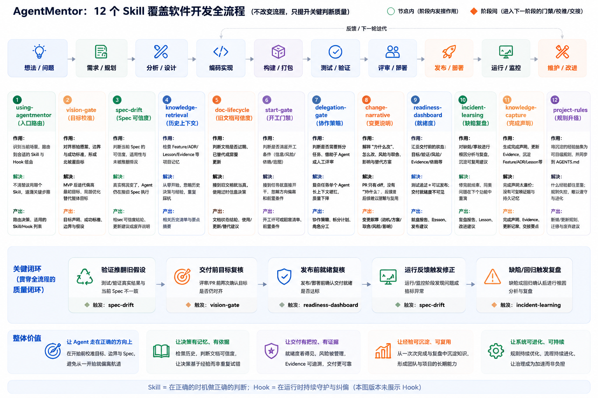

# AgentMentor：把 AI Agent 纳入可治理的软件开发流程

过去一年，AI 辅助开发领域已经出现了几类很有代表性的实践。

**Superpowers 试图解决的是 Agent 的执行纪律问题**：让 Agent 在 brainstorming、TDD、debugging、planning、review 等环节里，不再只是“快速写代码”，而是按更成熟的软件开发方法工作。

**OpenSpec 试图解决的是规格变更问题**：把一次需求修改拆成 proposal、spec、design、tasks，再在完成后 archive，让 AI 不只是听聊天记录写代码，而是围绕可追踪的规格演进。

这些方向都很有价值。

但真实项目继续往前走以后，会出现另一个更深的问题：

```text
Agent 会写代码了，
Agent 也会按计划做任务了，
需求也可以被写成 spec 了，

但一个长期软件项目，仍然可能在多轮 AI 迭代后变得不可恢复、不可验收、不可追溯、不可防复发。
```

问题不再只是“这次任务怎么做完”，也不只是“这次变更有没有 spec”。

**真正危险的是：**

- 目标在多轮迭代后慢慢漂移。
- 测试变绿，但验收目标已经偏了。
- review finding 被修掉了，但失败模式没有沉淀。
- 一个 Feature 反复 follow-up fix，却没人意识到抽象已经失效。
- 上下文被压缩后，关键决策、风险和取舍丢失。
- Agent 自信地宣布完成，但没有足够 Evidence 支撑。

这就是 AgentMentor 想补上的层次。

如果说 Superpowers 更像 Agent 执行纪律系统，OpenSpec 更像规格变更状态机，那么 AgentMentor 更像一套面向 AI Agent 的工程治理闭环。

**AgentMentor关注的不是让 Agent 写得更快，而是让 Agent 在长期软件开发中，始终处在可恢复、可验证、可追溯、可复盘、可防复发的工程系统里。**

AgentMentor 的竞争对象不是 Superpowers 或 OpenSpec，而是 AI Agent 大规模参与开发后产生的工程失控。

先放一组来自真实项目 ScienceClaw 的数据。

在这个项目里，AgentMentor 并不是停留在概念层面的流程设计，而是被用于一段重度 AI Agent 开发过程。统计已合入 `upstream/master` 的 PR，并排除 `data/*` 下约 `109,883` 行 RPA 捕获资产后，可以看到几个信号：

- AgentMentor 介入前，91 个 commit 没有形成 AgentMentor 治理文档；重度使用阶段，92 个 commit 形成了 9,719 行 AgentMentor docs。
- 重度使用阶段新增 25,712 行非测试源码，但 GitHub PR 页面可见 review finding 约 4 个，finding 密度约 0.16 / 1000 行非测试源码。
- 同期对照 PR `#58` 有 7,508 行 Superpowers specs/plans，但 1,048 行非测试源码中出现约 7-8 个 review finding，finding 密度约 6.68-7.63 / 1000 行非测试源码。
- PR `#59` 后续 8 个 commit 继续推进相关能力，其中导航相邻功能被 2 个 commit 触达、runtime integration 测试域被 1 个 commit 触达，未观察到同类 review finding；而同期对照 PR `#58` 在 review 后仍通过 4 个 follow-up commit 反复修补状态语义、candidate 生命周期、batch/realtime 一致性等同类问题。

这组数据不能被过度解读为“AgentMentor 严格证明缺陷率下降”。更准确地说，它说明一件事：在 AI 大规模写代码之后，真正拉开差距的不是“有没有文档”，而是文档是否形成了可验证、可恢复、可防复发的工程闭环。

**在 RPA Agent 中，AgentMentor支撑了 5w+行 非测试的功能源码开发，将 问题密度 从同期对照的约 6.68-7.63/千行 压到约 0.16/千行，并将BUG复踩率降低为0**
  

## 1. AI 编码时代的矛盾：代码变快了，工程判断变慢了

AI 编码工具最容易给人的第一印象是“快”。

一个功能，过去可能要半天写完；现在交给 Codex、Claude Code 或其他 coding agent，十几分钟就能看到一个能跑的版本。它能读文件、改代码、补测试、修 lint、生成 PR 描述，甚至可以连续跑几轮修复。

但真实开发一段时间后，另一个问题会慢慢浮出来：

```text
代码产出速度变快了，
但需求判断、边界审视、历史记忆、验证证据和失败复盘并没有自动变强。
```

这才是 AI 编码时代真正危险的地方。

很多问题不是以“代码明显写错”的形式出现，而是以“局部正确”的形式累积：

- 每一次补丁都能解释。
- 每一次兼容都有理由。
- 每一次新增分支都能让当前案例通过。
- 每一次测试变绿都让 Agent 更确信任务已经完成。

但几轮之后，系统可能已经变成另一个样子：

```text
功能越来越多，边界越来越糊；
测试越来越绿，目标越来越远；
补丁越来越密，抽象越来越脆；
上下文越来越长，真正重要的决策反而越来越难恢复。
```

在人工开发时代，写代码慢本身会形成一种天然刹车。开发者会在改动成本变高时停下来想一想：是不是抽象错了？是不是需求理解偏了？是不是应该重构边界？

Agent 不一样。

Agent 很擅长继续。它会继续补功能，继续修 bug，继续加测试，继续沿着已有结构往下写。

所以 AI 编码时代最稀缺的能力，不是继续生成，而是及时停下：

- 需求不清时停下。
- Spec 失真时停下。
- 补丁震荡时停下。
- 验证不足时停下。
- 上下文快丢失时停下。
- 经验应该沉淀时停下。

AgentMentor 想解决的，正是这个问题。

它不是让 Agent 写更多代码，而是把软件工程里的刹车、记忆、验收和复盘机制，变成 Agent 可执行、可恢复、可验证的工作系统。

## 2. AI 时代，软件开发主流程面临的新痛点

先把行业通用的软件开发主流程放出来。

无论团队采用敏捷、DevOps、PR Review、持续交付，还是个人项目里的轻量流程，大多数软件开发都可以抽象成一条从左到右的主线：


AI Agent 加入后，这条主线没有消失。

**真正变化的是：`编码实现` 这一段被极大加速，而其他环节没有同步升级。**

这会制造几个新的痛点。

### 2.1 MVP 后续迭代容易漂移

在 Superpowers + Codex 这类开发模式中，一个常见做法是先实现 MVP，再持续迭代到完整版本。

这个模式本身没有问题。

问题在于，MVP 写完以后，后续迭代很容易遗忘原始愿景、边界条件、业务约束和历史取舍。

结果是：

```text
完整版本的代码越来越多，
但它解决的问题可能越来越偏离最初预期。
```

更糟的是，当偏离发生后，Agent 往往会继续局部打补丁，而不是回到原始目标重新审视方案。

最终项目进入一种状态：

```text
不断修，不断偏，不断补。
```

### 2.2 长上下文不是可靠的工程记忆

Codex、Claude Code 这类 Agent 拥有越来越长的会话上下文，例如 256k token。

这很有帮助，但它不是可靠的工程记忆系统。

当会话上下文接近上限时，系统会触发被动压缩。压缩通常按照固定策略摘要历史信息，能保留大概脉络，却很容易丢失工程上最重要的细节：

- 需求细节。
- 约束条件。
- 历史取舍。
- 失败原因。
- 未完成事项。
- 哪些验证已经做过。
- 哪些风险只是暂时接受。

压缩之后，Agent 看似还记得任务，实际可能已经丢失了关键上下文。

另一个问题是上下文过长会诱发“上下文焦虑”。长会话后期，Agent 更容易急于完成任务，倾向于快速收尾、跳过回顾、弱化验证，导致需求对齐和交付稳定性下降。

所以最佳实践不是等系统被动压缩，而是在上下文即将变长时，主动要求 Agent 回顾当前任务，写出交接文档，再开启新会话读取交接文档继续开发。

这里的核心区别是：

- **压缩是被动的**：系统按固定逻辑压缩信息，保留的是摘要，不一定保留工程上最重要的细节。
- **交接是主动的**：Agent 基于任务目标、历史决策、当前状态、风险点和下一步计划，自主识别重要信息，并写入可恢复的交接文档。

### 2.3 测试变绿不等于目标达成

AI Agent 很适合跑测试，也很擅长根据失败修测试。

但测试只能证明它覆盖的东西。

如果测试保护的是一个局部补丁，测试越多，可能越会固化偶然复杂度。

真实开发里更危险的是这种情况：

```text
测试通过了；
PR 看起来合理；
用户验收时仍然觉得“不对”。
```

这往往不是测试问题，而是目标漂移、Spec 失真或抽象边界错位。

### 2.4 经验如果不沉淀，会在下一个功能里重演

开发功能 A 时踩过的坑，如果不沉淀，开发功能 B 时很可能再次出现。

Agent 不会天然记住“这个项目曾经为什么不要这么做”。聊天记录不是可靠记忆，长上下文也不是可靠制度。

真正可复用的经验，需要进入可检索、可验证、可引用的项目记忆：

- Feature：记录目标、边界、状态和验收。
- ADR：记录长期设计决策。
- Lesson：记录可复发失败模式。
- Evidence：记录完成声明的证据。
- AGENTS.md：记录未来 Agent 必须遵守的项目级规则。

这些不是文档形式主义。

它们的目标是让一次失败变成下一次开发的护栏。

### 2.5 局部补丁会掩盖抽象失效

Agent 很擅长沿着现有代码继续修。

这在普通 bugfix 里很有价值。一个空值异常、一个边界条件、一个版本兼容问题，局部修复通常就是正确路径。

但当问题来自抽象边界错误时，局部补丁会变得很危险。

它会让系统进入一种假性进展：

```text
每一轮都修了一个问题，
但每一轮都没有减少问题类别。
```

例如，同一个 Feature 反复出现 follow-up fix，每次都新增一个关键词、一个 fallback、一个场景分支、一个下游过滤条件。短期看，最新样本通过了。长期看，系统正在用越来越多补丁维持一个越来越脆弱的抽象。

这类问题如果不被识别，Agent 会继续补下去，直到代码变成历史特例集合。

### 2.6 评审只能看到 diff，看不到决策过程

AI 生成 PR 后，reviewer 往往能看到改了哪些文件、哪些测试通过了。

但真正难恢复的是：

- 为什么选这个方案？
- 为什么没有走另一个更直观的方案？
- 这个兼容逻辑是临时 workaround，还是长期设计？
- 哪些风险已经知道但暂时接受？
- 这次验证覆盖了什么，没有覆盖什么？

Diff 只能说明“发生了什么”，不能自动说明“为什么这样发生”。

如果变更叙事缺失，后续 Agent 或 reviewer 很容易重新探索已经被拒绝过的路径，或者把一个临时补丁误认为长期设计。

这就是为什么 AI 时代的 commit、PR、handoff 不能只依赖代码 diff。

### 2.7 完成声明变得太廉价

Agent 很容易说“完成了”。

它可能跑过一个测试，修掉最后一个报错，看到构建通过，然后自然地给出完成声明。

但工程上的完成不是一句话，而是一组可复核状态：

- 原始目标是否仍然对齐？
- 验证证据是否充分？
- 是否还有未关闭风险？
- 是否需要更新 Feature、ADR、Lesson 或 Evidence？
- 是否需要写交接文档，方便下一会话恢复？

当完成声明变得太廉价，团队会得到一种危险的错觉：

```text
任务看起来结束了，
但真正的交付状态没有被检查过。
```

这也是为什么 AgentMentor 会把 closeout 和 Evidence 放到完成声明之前。

## 3. 把 AgentMentor 放到软件开发主流程上

AgentMentor 不替代软件开发流程。

它是在主流程上叠加一层 Agent 治理机制。

有些 Skill 作用在节点上，有些 Skill 作用在节点之间的边上。节点代表开发阶段，边代表进入下一阶段前的门禁、校准或交接。



上面的简图想表达三件事：

1. AgentMentor 不改变主流程，它改变的是关键转折点上的判断质量。
2. Skill 不是功能菜单，而是不同阶段的工程控制点。
3. Hook 不是替代 Skill，而是把部分高频约束放到运行时。

如果把这套机制展开到完整软件开发流程上，可以得到下面这张总览图。

它不是想替代原有流程，而是在关键节点和阶段切换处增加判断、校准、交接和复盘能力：哪些 Skill 作用在阶段内，哪些 Skill 作用在阶段之间，哪些 Skill 负责形成质量闭环。



这张总览图里最重要的不是“有 12 个 Skill”，而是三层结构：

1. 上层是软件开发主流程：从想法、需求、设计、编码、测试、评审、发布到运行维护。
2. 中层是 AgentMentor 的控制点：每个 Skill 对应一个容易失控的工程判断。
3. 下层是质量闭环：验证推翻旧假设、交付前目标复核、发布前就绪复核、运行反馈修正、缺陷归因复盘。

因此，AgentMentor 的价值不是增加流程复杂度，而是把原本依赖资深工程师经验的判断点，变成 Agent 可触发、可执行、可检查的工程机制。

## 4. 12 个 Skill：从真实痛点里长出来的控制点

上图只是总览。真正重要的是，每个 Skill 都不是凭空设计出来的功能菜单，而是从 AI Agent 开发中的真实失控点里长出来的控制点。

先给出一个直观列表。

| Skill | 主要作用 | 对应痛点 |
| --- | --- | --- |
| `using-agentmentor` | 总入口和路由器 | 避免每次都加载所有治理流程，也避免该触发时漏触发。 |
| `start-gate` | 开工前门禁 | Agent 接到任务就直接写代码，缺少“能否开工”的判断。 |
| `vision-gate` | 原始目标校准 | MVP 后续迭代和局部补丁容易偏离最初愿景。 |
| `knowledge-retrieval` | 恢复项目记忆 | Agent 从当前上下文出发，忽略 Feature、ADR、Lesson、Evidence。 |
| `doc-lifecycle` | 判断旧文档可信度 | 搜到旧文档就当真，忽略过期、替代、归档状态。 |
| `spec-drift` | 判断 Spec 是否仍可信 | 真实案例已经推翻旧 Spec，Agent 仍忠实执行。 |
| `delegation-gate` | 判断是否需要 subagent / reviewer | 复杂任务被单个 Agent 在长上下文里一路做到底。 |
| `change-narrative` | 解释变更原因和取舍 | PR 只有 diff，没有为什么，后续 Agent 难以接手。 |
| `readiness-dashboard` | 交付前状态汇总 | 测试通过不等于可以 review、release、handoff。 |
| `knowledge-capture` | 完成声明和知识沉淀 | Agent 容易自信宣布完成，但没有 Evidence 或持久记忆。 |
| `incident-learning` | 缺陷和补丁链复盘 | Bug 修完就结束，同类失败以后继续出现。 |
| `project-rules` | 项目级规则升级 | 什么经验都塞进 AGENTS.md，规则本身变成复杂度。 |

下面逐个展开。

### 4.1 using-agentmentor：避免治理流程变成另一个噪音源

AgentMentor 一开始面对的不是“没有规则”，而是另一个更隐蔽的问题：

```text
如果规则太多，Agent 会不知道该用哪个；
如果入口不清，Agent 会要么全都跑一遍，要么关键时刻一个也不跑。
```

`using-agentmentor` 的初衷就是做总入口。

它不负责沉淀 Feature，不负责写 ADR，不负责判定完成。它只回答一个问题：

```text
当前任务是否触发 AgentMentor？
如果触发，应该进入哪个最小必要 workflow？
```

这个 Skill 的价值在于保持“轻”。

AgentMentor 不是让每个任务都变成重流程，而是让 Agent 在该轻的时候轻，在该停的时候停。

### 4.2 start-gate：补上“能不能开工”这个缺口

`start-gate` 的来源很直接。

早期 AgentMentor 已经要求非平凡任务检索上下文、做愿景校准、完成后做知识沉淀，但仍然缺一个明确的前置判断：

```text
现在到底能不能开始实现？
```

这个缺口带来的问题是：Agent 可能把本该在编码前存在的东西，拖到完成后才补。

例如：

- 本该先有 Feature，结果代码写完后才补 Feature。
- 本该先澄清目标，结果实现后才发现目标不清。
- 本该先查历史 ADR，结果沿着被拒绝过的路径又走了一遍。
- 本该先判断是否需要 spec，结果靠聊天上下文一路猜。

ADR-001 记录了这个判断：把 `start-gate` 作为非平凡实现前的第一道门。

它不创建 artifact，也不替代验证。它只做开工分流：

```text
ready
needs clarification
needs retrieval
needs vision gate
needs spec drift
needs delegation gate
needs Feature / spec / plan / ADR
blocked
```

它的核心价值不是增加流程，而是防止 Agent 在错误路径上高速启动。

### 4.3 vision-gate：解决 MVP 后续迭代的愿景漂移

`vision-gate` 针对的是一个非常真实的开发问题：

```text
MVP 写完以后，后续迭代越来越容易忘记原始目标。
```

比如一个需求不是简单地“实现流式响应”，而是：

```text
通过一段一段输出响应内容，降低用户等待感，提升交互体验。
```

如果只记得“流式响应”这四个字，后续实现很可能变成技术细节堆叠：怎么 flush、怎么 chunk、怎么展示 loading、怎么处理边界。但真正要守住的是用户等待感和交互体验。

所以开发前需要沉淀 spec。这里的 spec 不只是功能清单，而是愿景、业务目标、验收标准、非目标和约束条件。

开发后，最好让一个没有参与实现的独立 review sub-agent 读取 spec，从原始愿景出发审视代码是否跑偏。

`vision-gate` 要保护的就是这个东西：

```text
不是局部任务有没有完成，
而是完成物是否仍然逼近原始愿景。
```

### 4.4 knowledge-retrieval：防止 Agent 每次都从零猜

Agent 的上下文很长，但项目历史更长。

真实项目里的很多判断不在当前文件里，而在过去的 Feature、ADR、Lesson、Evidence、spec、plan 和 handoff 里。

没有 `knowledge-retrieval` 时，Agent 很容易像第一次接触项目一样行动：

- 不知道这个 Feature 的边界。
- 不知道某条路线之前被拒绝过。
- 不知道一个失败模式已经有 Lesson。
- 不知道一个行为已经有 Evidence。
- 不知道这次 bug 是新问题，还是旧 Feature 的 follow-up。

`knowledge-retrieval` 的初衷就是让 Agent 在行动前恢复项目记忆。

它不写文档，只负责读和判断。

这看似普通，但对 Agent 很关键：如果没有显式检索，Agent 会倾向于相信当前上下文已经足够。

### 4.5 doc-lifecycle：检索不是治理

随着 AgentMentor 文档增多，另一个问题会出现：

```text
搜到了文档，不等于文档仍然可信。
```

旧 ADR 可能已经被新 ADR 替代。旧 spec 可能只是草稿。旧 plan 可能已经完成或废弃。某个 Lesson 可能只适用于旧架构。

如果 Agent 只做检索，不判断生命周期，就会把过期认知重新带回当前任务。

这就是 `doc-lifecycle` 的来源。

它处理的是：

- stale。
- deprecated。
- superseded。
- archived。
- invalidates。
- updates。
- superseded_by。

它的核心原则很简单：

```text
Retrieval is not governance.
检索不是治理。
```

### 4.6 spec-drift：防止 Agent 忠实执行一个已经过期的 Spec

`spec-drift` 是最近很关键的一次能力补齐。

它来自一个 AI 编码时代非常典型的矛盾：

```text
AI 不仅可能不遵守 Spec，
也可能过度遵守一个已经过期的 Spec。
```

当真实案例、验证失败或用户反馈开始推翻旧 spec / acceptance criteria 时，Agent 不应该继续把旧 spec 当成圣旨局部打补丁。

它应该先判断：

- 当前 Spec 是否仍然可信？
- 这是 implementation bug，还是 Spec 假设错误？
- 验收标准是否偏离了原始目标？
- 新案例是旧模型的扩展，还是旧模型的反例？
- 是否需要更新 Feature、Spec、ADR 或 Lesson？

F008 的目标就是为 AgentMentor 增加这层克制的 Spec Drift 防护。

这个 Skill 的边界也很重要：它不是 Architecture Review，不自动改 AGENTS.md，不把 Start Gate 或 Vision Gate 扩展成全量架构审查。

它只做一件事：

```text
当旧 Spec 可能失真时，先停下判断 Spec 是否仍可信。
```

### 4.7 delegation-gate：让复杂任务不要被单 Agent 长上下文吞掉

复杂需求不应该总是让一个 Agent 在一个长上下文里从讨论、设计、编码、验证一路做到结束。

更合理的协作方式是：

1. 主 Agent 负责需求讨论、愿景澄清、spec 沉淀和任务拆分。
2. 多个 sub-agent 分别实现相对独立的子任务。
3. 独立 review sub-agent 负责代码审视和需求对齐检查。

`delegation-gate` 的初衷就是让这个协作策略显式化。

它问：

```text
这件事是否应该由主 Agent 单独完成？
是否需要 subagent、并行探索或独立 reviewer？
```

不过，这个 Skill 当前也最需要继续演进。

如果平台没有稳定的 subagent / reviewer 调度能力，它就容易只停留在“显式声明 single_agent”的层面。

所以它现在更像一个重要但尚未完全落地的控制点：问题真实存在，但还需要和实际 Agent 调度能力结合。

### 4.8 change-narrative：PR 不能只剩 diff

很多 PR 的问题不是代码看不懂，而是不知道为什么这样改。

Agent 生成的 diff 可能很完整，但后续 reviewer 或下一个 Agent 会遇到几个问题：

- 为什么选这个方案？
- 为什么没选另一个更直观的方案？
- 这个 workaround 是临时的还是长期的？
- 验证过什么？
- 哪些风险是已知但接受的？

`change-narrative` 的初衷不是强制 commit / PR 格式。

它约束的是变更叙事质量：

```text
未来的人或 Agent 能不能理解这次变更为什么存在？
```

对于 tiny commit，不需要强塞模板。

对于非平凡改动，它至少应该说明：

- 改了什么。
- 为什么要改。
- 怎么实现。
- 为什么没走其他路径。
- 做了哪些验证。

Diff 记录的是发生了什么，Change Narrative 记录的是为什么这样发生。

### 4.9 readiness-dashboard：测试通过之后，还差什么？

测试通过不等于可以 review。

Review 通过不等于可以 release。

Release 准备好不等于可以 handoff。

`readiness-dashboard` 的初衷是做状态汇总，而不是做新的完成判定。

它回答：

```text
现在能否安全进入下一个阶段？
如果不能，还缺什么？
```

它会看：

- Entry Gate 是否完成。
- Vision Gate 是否需要复核。
- Delegation Gate 是否缺失。
- 验证证据是否充分。
- 非 tiny bugfix 是否做了 Feature attribution。
- 是否存在 patch churn。
- 是否需要 Evidence、ADR、Lesson 或 handoff。

它的价值是把风险显性化。

这和 `knowledge-capture` 不同。`readiness-dashboard` 是状态面板，`knowledge-capture` 才拥有完成声明权限。

### 4.10 knowledge-capture：完成不是一句话，而是一个可复核状态

Agent 很容易在跑完测试后说：

```text
完成了。
```

但在工程里，“完成”不是语气，而是证据状态。

`knowledge-capture` 的初衷就是把完成声明变成可复核动作。

它要判断：

- 是否有验证证据？
- 是否需要 Evidence？
- 是否需要更新 Feature？
- 是否需要 ADR 记录决策？
- 是否需要 Lesson 防止复发？
- 是否需要 Backlog 或 Handoff？
- 是否可以明确说 no formal artifact needed？

这不是要求每次都写文档。

恰恰相反，`knowledge-capture` 要避免文档形式主义：

```text
只沉淀未来需要恢复、验证或约束的内容。
```

它解决的是“完成声明缺少证据”的问题。

### 4.11 incident-learning：Bug 修完之后，失败有没有变成护栏？

真实开发中，一个 bug 修完并不代表事情结束。

如果它暴露的是可复发失败模式，那么只修代码是不够的。

`incident-learning` 的来源就是这种经验：

```text
代码修复只能止血；
incident learning 要判断是否需要免疫系统。
```

它特别适合处理：

- 回归。
- 事故。
- 重复失败。
- 多轮 patch。
- 规则越补越多。
- 同一 Feature 的 Fxxx.n follow-up 链条。

Patch Churn 提案里有一个很典型的案例：F018 从 F018.1 到 F018.7 逐步修复触发、展示、格式、流式边界、Composer 过滤等问题，直到后面才明确根因是 `retrieved candidate != accepted evidence`。

也就是说，前面的补丁大多在下游修症状，真正需要前移的是证据合同边界。

这类问题不是普通 bug，而是补丁震荡。

`incident-learning` 要做的是让 Agent 停下来问：

```text
我们是在修实现，还是在替错误抽象续命？
```

### 4.12 project-rules：把经验升级成规则，也要克制

当一个 Lesson 很有价值时，很容易产生冲动：

```text
把它写进 AGENTS.md，让以后所有 Agent 都看到。
```

但这也有风险。

`AGENTS.md` 是高注意力文件。未来 Agent 每次进入项目都会读它。如果什么经验都塞进去，它很快会变成长篇历史记录，反而降低有效约束。

`project-rules` 的初衷是给规则升级加一道门：

```text
这条经验是否真的应该成为项目级 Agent 行为规则？
```

只有满足这些条件，才值得升级：

- 跨任务有效。
- 会改变未来 Agent 行为。
- 可操作、可验证。
- 有 ADR、Lesson、Evidence 或用户明确指令支撑。
- 注意力成本值得。

否则，它应该留在 Feature、ADR、Lesson 或 Evidence 里。

治理复杂度时，也要治理规则本身的复杂度。

## 5. Stop-only Hook：长上下文时代的运行时安全网

Skill 是 AgentMentor 的主能力。

Hook 是运行时增强。

它解决的是另一个宏观问题：

```text
长上下文不是记忆系统。
```

Codex / Claude Code 这类 Agent 虽然拥有较长的会话上下文，例如 256k token，但上下文并不是可靠的工程记忆系统。

当会话上下文接近上限时，系统会触发被动压缩。压缩通常按照固定策略摘要历史信息，这能保留大概脉络，但容易丢失需求细节、约束条件、历史取舍、失败原因和未完成事项。

对后续开发来说，这会带来隐性风险：

```text
Agent 看似还记得任务，
实际已经丢失了关键上下文。
```

另一个问题是上下文过长会诱发“上下文焦虑”。Agent 在长会话后期更容易急于完成任务，倾向于快速收尾、跳过回顾、弱化验证，导致代码质量、需求对齐和交付稳定性下降。

所以最佳实践不是等系统被动压缩，而是在上下文即将变长时，主动要求 Agent 回顾当前任务，写出交接文档，再开启新会话读取交接文档继续开发。

这里的核心区别是：

- **压缩是被动的**：由系统按照固定逻辑压缩信息，保留的是摘要，不一定保留工程上最重要的细节。
- **交接是主动的**：由 Agent 基于任务目标、历史决策、当前状态、风险点和下一步计划，自主识别重要信息，并写入可恢复的交接文档。

早期 AgentMentor 曾尝试用 `PreCompact` 和 `SessionStart` 在运行时层面缓解这个问题：当系统即将压缩上下文时，尽量写下可恢复快照；当同一会话从 compact 中恢复时，再把这份快照注入回来。

但这个方向已经被 F015 收敛：当前默认 hook runtime 不再提供 `pre-compact` / `session-start` session recovery。原因是 hook 只能被动捕获平台 payload 或 transcript tail，不能让 Agent 在压缩前主动生成高质量结构化 handoff，因此和平台自身 compaction 能力重叠且收益不稳定。当前建议是：需要交接时显式写 handoff，不把 compact recovery 作为默认 hook 能力。

`Stop` Hook 则处理另一个相邻问题：长上下文后期，Agent 容易急于结束，于是跳过 closeout、弱化 Evidence、直接宣布完成。它在 Agent 准备停下时检查完成声明，防止“语气上完成了，工程上还没有完成”。

当前 AgentMentor 插件默认只保留 1 个正式 Hook：

| Hook | 触发时机 | 作用 |
| --- | --- | --- |
| `Stop` | Agent 准备结束回复时 | 检查完成声明是否经过 closeout |

`post-tool-use` 仍作为实验入口保留，但不进入默认安装路径。原因很直接：工具调用粒度太细，容易把多文件编辑过程切碎成高噪音检查；当前更清晰的边界是在 Stop、readiness、closeout 或 CI 阶段运行严格校验。

### 5.1 已移除：PreCompact / SessionStart 自动恢复

`PreCompact` / `SessionStart` 的历史价值在于暴露了一个边界：runtime recovery 不是项目记忆，不能污染新任务。但作为默认能力，它们已经被移除。当前 AgentMentor 将 compact 后恢复交给平台自身机制；如果任务需要交接，应由 Agent 显式写 handoff 或更新 Feature / Evidence / Backlog 等 canonical artifact。

### 5.2 Stop：对抗长上下文后期的仓促收尾

Agent 很容易自信地说“完成了”。

长上下文后期尤其如此。

当上下文越来越长，Agent 往往会更想尽快收束任务：修最后一个报错，跑一个测试，然后给出“已完成”的回答。这个行为在体验上很顺滑，但工程上很危险。

因为真正的完成不只是“最后一次命令通过”，还包括：

- 是否回到原始目标检查过。
- 是否有足够 Evidence。
- 是否说明了未覆盖风险。
- 是否需要更新 Feature / ADR / Lesson。
- 是否需要交接给下一会话。

`Stop` Hook 在 Agent 准备结束回复时检查最终输出。如果检测到完成类表达，例如 done、complete、fixed、verified、ready，就调用 closeout 检查。

如果没有有效 closeout block，它可以阻止输出。

这不是为了挑文字毛病，而是为了防止一个高频失败：

```text
Agent 语气上完成了，工程上还没有完成。
```

在 AgentMentor 里，完成声明至少应该能回答：

- Entry Gate 状态是什么？
- Vision Anchor 是什么？
- Evidence 是什么？
- Feature / ADR / Lesson 是否需要更新？
- Check 是否通过？
- Completion claim 是否允许？

### 5.3 为什么 Hook 必须 fail-open

Hook 是增强，不是系统单点。

AgentMentor 的 hook runner 采用 fail-open：运行时配置、平台事件、命令路径出错时，默认不让 Hook 把 Skill-only 工作流整体打断。

这来自真实集成经验。

Codex / Claude Code / OpenCode 的 hook 生命周期和命令执行边界并不完全一样。曾经出现过设置界面能看到 Hook，但实际没有运行痕迹；也出现过 Windows 下 `%PLUGIN_ROOT%` 在 PowerShell 中没有展开，导致所有 hook 退出 code 1。

所以 Hook 的定位必须克制：

```text
Skill 是主流程；
Hook 是运行时安全网；
Hook 失败不能让治理系统本身变成新的脆弱点。
```

## 6. 把需求开发纳入 AgentMentor 流程

AgentMentor 背后的实践思路，可以概括为：

```text
让需求开发不再依赖单次会话记忆，
而是进入一个可恢复、可审视、可验证、可沉淀的工程闭环。
```

### 6.1 愿景守护

开发前先沉淀 spec。

这个 spec 不只是功能清单，而是要写清楚：

- 需求愿景。
- 业务目标。
- 验收标准。
- 非目标。
- 约束条件。

开发完成后，再启动没有参与实现的独立 Code Review sub-agent，让它读取 spec，从原始愿景出发审视代码是否跑偏。

这对应 `vision-gate`、`start-gate` 和 `readiness-dashboard`。

### 6.2 多 SubAgent 协作开发

复杂需求不应该让单个 Agent 在一个长上下文里从头做到尾。

更合理的方式是：

1. 主 Agent 负责需求讨论、愿景澄清、spec 沉淀和任务拆分。
2. 多个 sub-agent 分别实现相对独立的子任务。
3. 独立 review sub-agent 负责代码审视和需求对齐检查。

这对应 `delegation-gate`。

虽然它当前还需要更强的实际调度能力，但方向是清楚的：减少单 Agent 长上下文漂移。

### 6.3 知识沉淀

开发功能 A 时踩过的坑，如果不沉淀，开发功能 B 时很可能再次出现。

所以在功能完成、实际验证、发现缺陷并修复之后，需要让 Agent 反思这类问题是否具有复发风险。

如果会复发，就沉淀为：

- `Lesson`：记录失败模式、根因、触发条件和防护机制。
- `AGENTS.md` 军规：当经验足够稳定、通用、可执行时，晋升为项目级规则。

这对应 `incident-learning`、`knowledge-capture` 和 `project-rules`。

### 6.4 开发前门禁

开发前应该检查是否已经准备好必要的前置材料：

- 是否存在 spec。
- spec 格式是否符合规范。
- 是否包含愿景、验收标准、非目标、约束条件等关键字段。
- 是否需要查 Feature / ADR / Lesson / Evidence。
- 是否存在 stale spec 或 patch churn 信号。

这一步的目的不是制造流程负担，而是防止 Agent 在需求边界不清时直接开工。

这对应 `start-gate`、`knowledge-retrieval`、`doc-lifecycle` 和 `spec-drift`。

### 6.5 开发后门禁

开发完成后，还要检查：

- 是否有验证证据。
- 是否记录了实现结果。
- 是否发现可复发问题。
- 是否需要沉淀 Lesson。
- 是否需要更新 `AGENTS.md` 项目规则。
- 是否需要写交接文档，方便新会话恢复上下文。

这对应 `readiness-dashboard`、`change-narrative`、`knowledge-capture`、`incident-learning` 和 Hook runtime。

## 7. ScienceClaw 实践数据：AgentMentor 到底带来了什么变化

前面讲的是 AgentMentor 的问题意识和工作机制。

但工程方法论如果只有理念，很容易变成自我说服。所以这里用 ScienceClaw 这个真实项目做一次效果展示。

统计口径先说清楚：

- 统计范围是 ScienceClaw 中已合入 `upstream/master` 的 PR。
- 主要观察对象是 TangHui-Best 的 AgentMentor 使用阶段。
- 排除 `data/*` 下约 `109,883` 行 RPA 捕获资产。这些 HTML / JSON 步骤资产主要由 RPA 功能运行产生，不应计入 AgentMentor 的治理价值分析。
- “非测试源码”指排除测试目录后的 `.py`、`.vue`、`.ts`、`.js`、`.css`、`.html`、`.tsx`、`.jsx`、`.sh`、`.ps1` 等源码类文件。

### 7.1 治理密度从 0 变成可量化

我们把 TangHui-Best 在 ScienceClaw 中的合入 PR 分成三个阶段：

| 阶段 | PR 范围 | commit 数 | 非测试源码新增 | AgentMentor docs 新增 | 每 1000 行源码对应 docs | 每 commit 对应 docs |
|---|---|---:|---:|---:|---:|---:|
| 前 AgentMentor | `#5-#52` | 91 | 12,108 | 0 | 0 | 0 |
| 导入阶段 | `#53 #55 #56 #57` | 87 | 8,328 | 1,763 | 211.7 行 | 20.3 行 |
| 重度使用阶段 | `#59` | 92 | 25,712 | 9,719 | 378.0 行 | 105.6 行 |

这张表最重要的不是“文档变多了”。

它真正说明的是：AgentMentor 介入后，复杂 AI 开发开始持续沉淀需求边界、验证证据、架构取舍和失败复盘。尤其是重度使用阶段，表面上只有 1 个 PR，但实际包含 92 个 commit，本质上是一段长周期、多轮修复、多次 review 的复杂迭代。

如果没有工程记忆，这类长迭代很容易进入“不断修、不断偏、不断补”的状态。

### 7.2 复杂变更没有带来同比放大的 review finding

再看 GitHub PR 页面可见的 P0/P1/P2/P3/P4 review finding。这里不使用 `issue comments`，因为普通评论不能等同于代码 review 问题。

| 阶段 | 非测试源码新增 | raw review findings | effective findings | effective findings / 1000 行源码 |
|---|---:|---:|---:|---:|
| 前 AgentMentor | 12,108 | 约 9 | 约 9 | 0.74 |
| 导入阶段 | 8,328 | 约 11 | 约 7 | 0.84 |
| 重度使用阶段 | 25,712 | 约 4 | 约 4 | 0.16 |

其中，`#57` 有约 4 个 finding，但后续判断更像旧 merge-ref / stale diff review 噪音，因此区分 raw 与 effective。`#59` 至少有 4 个 finding，其中约 3 个 P1、1 个 P2。

这组数据仍然不能写成严格因果证明。

更稳妥的结论是：

> AgentMentor 介入后，复杂变更的 review finding 密度没有随规模放大；在重度使用阶段，单位源码 review finding 密度反而最低。

### 7.3 同期对照：普通 specs/plans 并不天然压低缺陷密度

为了避免只做自我前后对比，我们再引入同期同仓库的对照组。窗口为 `#53-#59` 合入期间。

| 组别 | PR | 普通过程文档新增 | AgentMentor 治理文档新增 | 说明 |
|---|---|---:|---:|---|
| 对照组 | `#54 #58` | Superpowers specs/plans：7,508 行 | 0 | 有规格/计划文档，但没有 Feature/Evidence/ADR/Lesson |
| AgentMentor 组 | `#53 #55 #56 #57 #59` | 不展开统计 | 11,482 行 | 额外形成 Feature/Evidence/ADR/Lesson 闭环 |

这个对照很关键：对照组并不是无文档开发。它同样新增了 7,508 行 Superpowers specs/plans。

也就是说，问题不在于“有没有文档”，而在于文档是否能形成闭环。

以 `#58` 和 `#59` 对比：

| PR | 组别 | 非测试源码新增 | review findings | findings / 1000 行非测试源码 |
|---|---|---:|---:|---:|
| `#58` | 对照组 | 1,048 | 约 7-8 | 6.68-7.63 |
| `#59` | AgentMentor 重度使用 | 25,712 | 约 4 | 0.16 |

同期对照组 `#58` 有大量 specs/plans，但 review finding 密度仍达到约 6.68-7.63 / 1000 行源码。相比之下，AgentMentor 重度使用的 `#59` 在更大规模变更下，finding 密度约为 0.16 / 1000 行源码。

这说明普通计划文档不必然压低缺陷密度。AgentMentor 的差异在于：它不只描述“准备怎么做”，还会把实现结果、验证证据、review finding、架构取舍和防复发规则串成可恢复的工程链路。

### 7.4 从“修复 commit”到“防复发闭环”

`#58` 的 review finding 主要集中在状态语义、异步任务和候选生命周期上。

| 类别 | 表现 |
|---|---|
| 状态语义不一致 | `uncertain`、`intent_review`、`generated`、`reserve/intent` 等状态在不同路径下语义不一致 |
| candidate 生命周期问题 | 正在执行的 intent prune task 被取消，导致 candidate ID 丢失 |
| batch / realtime 路径不一致 | batch 路径与 realtime 路径对候选状态、generated 标记处理不一致 |
| debounce / in-flight flush 问题 | batch 生成失败、flush 时机和 timeout 文档需要补丁修复 |
| 测试断言滞后 | 修复状态语义后，还需要单独更新测试断言 |

`#58` review 后明显有 4 个修复 commit：

| commit | 修复内容 |
|---|---|
| `01ea6285` | 统一意图裁剪状态语义：`uncertain -> intent_review`，batch 路径标记 generated，同步 reserve/intent 字段 |
| `5b1ee69f` | 不取消正在执行的意图裁剪任务，避免丢失 candidate ID |
| `835b5e81` | 更新测试断言以匹配 `uncertain -> intent_review` 语义 |
| `f0013db3` | batch 生成失败标记候选状态，区分 debounce / in-flight flush，并同步 timeout 文档 |

这些修复说明，`#58` 并不是离散小问题，而是在多次 commit 中反复围绕“状态语义 / candidate 生命周期 / batch 与 realtime 一致性”修补。

相比之下，`#59` 的 P1/P2 finding 进入了更完整的防复发链路：

| Review finding | 修复与沉淀 | 后续触达观察 |
|---|---|---|
| P1：短输入值全局污染 HTML/trace | `eab818eb fix: scope harness fill sanitization`；沉淀到 `F002.12`、`EV-002`，含 RED/GREEN 与 focused regression | PR #59 后 8 个 commit 中，`harness/capture.py`、checkpoint capture 测试、`F002/EV-002` 未再被修改；后续触达 0 次，未见同类 finding |
| P1/P2：Harness/Core 边界污染主链路事实 | `61a46a97`、`1c2850c2` 等；沉淀到 `F024`、`EV-024`、`ADR-004`、`LL-002`、`AGENTS.md` | PR #59 后 8 个 commit 中，核心边界文档和 `rpa/manager.py` 未再被修改；后续触达 0 次，未见同类 finding |
| P1：显式导航重定向重复记录 trace | `bc52a231 fix: suppress redirected explicit navigation events`；沉淀到 `F024.7`、`EV-024`，含 RED `1 failed as expected`、GREEN `1 passed`、focused navigation `5 passed` | PR #59 后 8 个 commit 中，导航相邻功能被 2 个 commit 触达：`0767e8de`、`82c3886b`；未见同类 redirect/navigation duplication finding |
| P1：测试隔离不足，integration test 环境不可用 | `4616204f fix: isolate harness ai capture route tests`；review 复测确认相关 tests passed，但正式文档沉淀弱于前三项 | PR #59 后 8 个 commit 中，相关 runtime integration 测试域被 1 个 commit 触达：`0767e8de`；未见同类测试隔离 finding，但这项可作为 AgentMentor 仍需改进的例子 |

两者的差异不在于有没有修复，而在于修复后留下了什么。

| 维度 | 对照组 `#58` | AgentMentor 组 `#59` |
|---|---|---|
| review 后处理方式 | 4 个 follow-up commit 修补问题 | P1/P2 对应修复 commit + Evidence/Feature/ADR/Lesson/AGENTS |
| 问题形态 | 状态语义、candidate 生命周期、batch/realtime 一致性反复修补 | HTML 污染、Core/Harness 边界、导航重定向、测试隔离被结构化沉淀 |
| 防复发证据 | 主要靠代码修复和测试调整 | RED/GREEN、focused regression、Patch History、ADR、Lesson、项目规则 |
| 后续可恢复性 | 需要读 commit 和 specs/plans 还原上下文 | 可以从 Feature/Evidence/ADR/Lesson 恢复问题、根因、验证与边界 |

因此，`#58` 展示的是“review 后继续修补”；`#59` 展示的是“review 后形成防复发资产”。

这正是 AgentMentor 与普通 specs/plans 的关键差异。

AgentMentor 的价值不是让 AI 不犯错，而是让错误被发现、被修复、被验证、被沉淀，并在后续迭代中具备可检查的防复发路径。

## 8. AgentMentor 与 Superpowers、OpenSpec 的关系

如果放到今天 AI 辅助开发的工具谱系里，可以这样理解：

| 方案 | 主要解决的问题 | 更像什么 |
| --- | --- | --- |
| Superpowers | 让 Agent 在单次开发任务中遵守更好的工程纪律，例如 brainstorming、TDD、debugging、plan、review | Agent 执行纪律系统 |
| OpenSpec | 让需求变更围绕 spec、change、task、archive 被组织和归档 | 规格变更状态机 |
| AgentMentor | 让 Agent 参与长期软件工程时，目标、边界、证据、失败、决策和恢复过程可治理 | 工程治理闭环 |

这三者不是简单替代关系。

Superpowers 能让 Agent 更像一个纪律良好的开发者；OpenSpec 能让变更更像一个可归档的规格提案；AgentMentor 要解决的是更长周期的问题：当 Agent 连续参与多个功能、多轮 review、多次修复和多次上下文恢复时，项目如何避免只留下越来越多代码，却没有留下可验证、可恢复、可防复发的工程判断。

因此，AgentMentor 的差异不在于“也有 Skill”或“也有文档”，而在于它把软件工程中的刹车、记忆、验收和复盘机制，拆成 Agent 可触发、可执行、可检查的治理点。

## 9. AgentMentor 与 Prompt、Skill、文档模板的区别

AgentMentor 很容易被误解成一组更长的 Prompt，或者一套文档模板。

但它的层级不同。

```text
Prompt 解决单次表达。
Skill 解决单次工作流。
AgentMentor 解决长期工程治理。
```

Prompt 可以告诉 Agent 这次该怎么做。

Skill 可以让 Agent 在某类任务里按步骤工作。

AgentMentor 要解决的是跨任务、跨会话、跨失败、跨文档的工程连续性：

- 开工前有门禁。
- 设计前能恢复记忆。
- Spec 失真时能停下。
- 交付前能复核 readiness。
- 完成前要有 closeout。
- 失败后能沉淀 Lesson。
- 项目规则能被治理。
- 上下文压缩前能保存恢复点。

这就是它和普通 Skill 集合的区别。

AgentMentor 不是“更多提示词”，而是把工程判断拆成可触发、可恢复、可验证的控制点。

## 10. 一个典型工作流示例

假设用户说：

```text
这个功能再兼容一种新的输入格式。
```

没有 AgentMentor 时，Agent 很可能直接进入代码：

```text
读相关文件
找到解析逻辑
加一个分支
补一个测试
宣布完成
```

这条路径有时是对的。

但如果这是同一个 Feature 的第三次兼容修复，它可能就是错的。

AgentMentor 会让 Agent 在开工前先问：

```text
这是 tiny bugfix，还是非平凡 follow-up？
是否已有 Feature 记录？
Patch History 里是否已经有多次类似修复？
新输入格式是旧模型的扩展，还是旧模型的反例？
继续加分支是否会扩大复杂度？
```

可能的流程会变成：

```text
using-agentmentor
  -> start-gate
  -> knowledge-retrieval
  -> spec-drift or vision-gate
  -> implementation
  -> verification
  -> readiness-dashboard
  -> change-narrative
  -> knowledge-capture
```

这不是为了让每个小任务变复杂。

而是为了在任务已经显示出复杂度信号时，不让 Agent 继续沿着最顺手的补丁路径走下去。

AgentMentor 关心的不是“这次能不能补上”，而是：

```text
这次补上以后，系统是否更清楚？
未来 Agent 是否知道为什么这样补？
如果这是错误抽象的信号，是否已经被识别？
```

## 11. 结语：Agent 时代真正需要治理的是失控

代码会越来越容易生成。

这几乎已经是确定趋势。

但软件工程真正困难的地方，并不会因此消失。它只是从“怎么写代码”转移到了更上游、更长期的问题：

- 该不该做？
- 目标是不是这个？
- 旧文档还能不能信？
- 当前抽象是否还成立？
- 测试保护的是不变量还是补丁？
- 什么时候应该停下？
- 完成声明是否有证据？
- 这次失败是否应该改变未来规则？

AgentMentor 的价值，就是把这些判断从人脑里的经验，变成 Agent 可以执行的工程流程。

它不替代开发流程。

它也不要求每次都走重流程。

它做的是在行业通用软件开发主线上，加入一套面向 Agent 的治理层：

```text
开工前，防止错误路径启动。
实现中，防止错误抽象续命。
交付前，防止无证据完成。
反馈后，防止经验消失。
长期看，防止项目规则和知识体系膨胀失控。
```

如果用一句话总结：

> AgentMentor 不是让 AI Agent 更快地写代码，而是让 AI Agent 在可恢复、可验证、可追溯、可复盘的工程系统里写代码。

这也是我认为 Agent 时代真正需要补上的东西。

## 附录：AgentMentor 当前还不完美

介绍一个项目时，只讲它解决了什么是不够的，也要讲它还没有解决什么。

AgentMentor 当前至少还有几个需要继续演进的地方。

### A.1 delegation-gate 还需要和实际调度能力结合

`delegation-gate` 当前能表达“是否应该委派”，但如果平台没有稳定 subagent 能力，它很难真正改变执行路径。

后续它要么增强为实际调度入口，要么降级为 `start-gate` / `readiness-dashboard` 的规则分支。

保留它的原因是：协作策略这个问题真实存在。

但它需要更多运行时能力支撑。

### A.2 readiness 与 closeout 的边界要继续保持清晰

`readiness-dashboard` 容易和 `knowledge-capture` 混在一起。

前者回答：

```text
现在离 review / release / handoff / completion 还差什么？
```

后者回答：

```text
是否允许声明完成，是否需要沉淀持久记忆？
```

这两个问题相近，但不能合并。

一个是状态汇总，一个是完成权限。

### A.3 文档治理要防止反向膨胀

AgentMentor 反对失控，但治理机制本身也可能失控。

如果每次任务都写 Feature、ADR、Lesson、Evidence，系统会从“代码复杂”变成“文档复杂”。

所以 AgentMentor 必须坚持一个原则：

```text
只沉淀未来需要恢复、验证或约束的内容。
```

没有未来价值的文档，就是新的噪音。

### A.4 Hook 是增强，不是唯一防线

Hook 曾经尝试帮助保存恢复上下文，但当前默认能力已经收敛为 Stop-time completion check。

但 Hook 不应该成为 AgentMentor 的唯一依赖。

真正的治理能力应该首先存在于 Skill 工作流里。

Hook 只是把一部分高频、低歧义、可检测的动作自动化。
